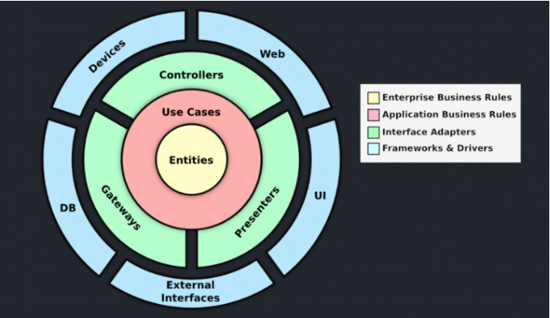

# ASP.NET Core Web API | Created with dotnet v6

### Install Dependencies
```
dotnet install
```

### Use dotnet to install lib class
```
dotnet new classlib --name <NAME>
```
### Use dotnet to add new package
```
dotnet add <PROJECT> package <PACKAGE> 
```

### Run Project
```
dotnet run --project WebApi
```
## Docker Build and Publish
```
docker build -t dotnet-template .

docker run -d -p 8080:80 --name dotnet-template dotnet-template 

http://localhost:8080/

docker images

docker tag [IMAGE_ID] [OWNER]/dotnet-template:latest

docker push [OWNER]/sample-netcore
```

## Adding Clean Architecture


